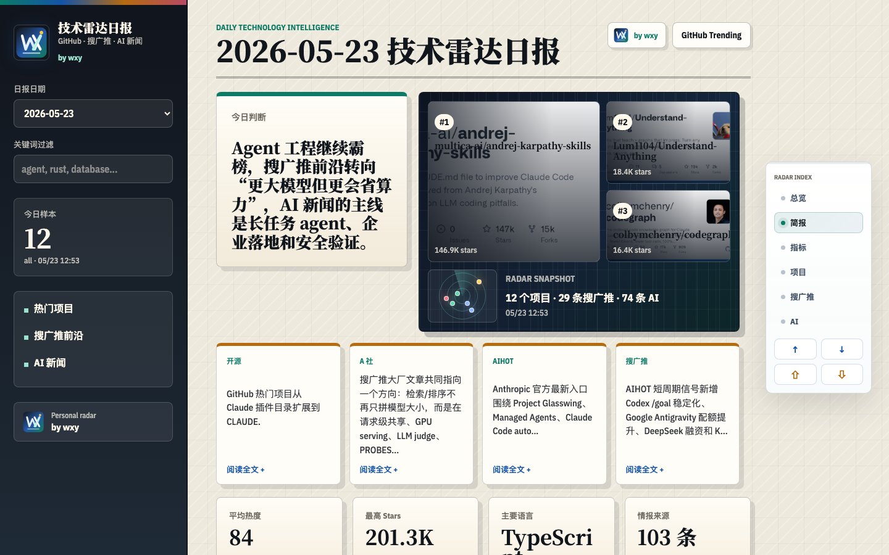

# Echo Trending

> Hourly technology radar for GitHub trending projects, search/ads/recommendation engineering, and AI industry signals.

[](https://eshener.github.io/echo-trending/)
[](.github/workflows/daily.yml)
[](LICENSE)

Echo Trending 是一个每小时更新的中文技术情报站。它把 GitHub 热门项目、搜广推大厂工程文章、AIHOT、Anthropic / OpenAI / Google AI 等动态整理成可扫读的日报，并保留可展开的深度解读。

Live site: https://eshener.github.io/echo-trending/



## Why Star This

- **不是简单榜单**：每个热门项目会被解释为工程信号、可落地场景、风险和推荐动作。
- **覆盖工程前沿**：单独跟踪搜索、广告、推荐、LLM 评测、排序和基础设施方向的大厂文章。
- **AI 新闻有筛选**：关注真正影响产品和工程决策的 AI 动态，而不是信息流搬运。
- **静态、可 fork、低成本**：生成 JSON + 静态页面，GitHub Pages 即可发布。

If this helps your daily technical radar, give the repo a star. It directly helps more engineers discover it.

## What It Tracks

```text
GitHub Trending / Search API
        |
README + languages + repo metadata
        |
Search / Ads / Recommendation engineering sources
        |
AIHOT + official AI company feeds
        |
Chinese structured analysis -> JSON reports -> GitHub Pages
```

## Current Product

- Hourly report page with date selector and keyword filter
- GitHub project cards with score, maturity, signal board, and deep-dive section
- Dedicated search/ads/recommendation frontier section
- Dedicated AI news section, including Anthropic-related signals
- Floating table of contents and quick scroll controls
- 90-day retention by default to keep the repository lightweight

## Local Development

Generate sample data:

```bash
npm run sample
```

Serve the static site:

```bash
npm run serve
```

Open:

```text
http://127.0.0.1:8787
```

## Generate A Real Report

```bash
GITHUB_TOKEN=xxx npm run daily
```

Useful environment variables:

```bash
REPORT_TIMEZONE=Asia/Shanghai
REPORT_RETENTION_DAYS=90
OPENAI_API_KEY=xxx
OPENAI_MODEL=your-model
```

Without OpenAI variables, the script still produces a rules-based report from repo metadata, README, languages, stars, and topics.

Generated reports are written to:

- `data/reports/YYYY-MM-DD.json`: archive copy
- `public/reports/YYYY-MM-DD.json`: site copy
- `public/reports/index.json`: report index

## Publishing

This repository publishes only through GitHub Pages.

- Source branch: `main`
- Published branch: `gh-pages`
- Workflow: `.github/workflows/daily.yml`
- Public URL: https://eshener.github.io/echo-trending/

In GitHub repository settings:

1. Go to `Settings -> Pages`
2. Set `Build and deployment` source to `Deploy from a branch`
3. Select `gh-pages` and `/ (root)`
4. Run `Echo Trending Deploy` once from GitHub Actions if needed

## Roadmap

See [docs/ROADMAP.md](docs/ROADMAP.md).

## Contributing

High-value contributions include:

- adding reliable engineering sources
- improving project scoring and analysis logic
- improving the visual explanation cards
- fixing mobile/desktop layout issues
- translating selected reports or README sections

Start with [CONTRIBUTING.md](CONTRIBUTING.md), or open an issue with a concrete source or product idea.

## Operating Notes

Growth, release cadence, and community operations are tracked in [docs/GROWTH_PLAYBOOK.md](docs/GROWTH_PLAYBOOK.md).

## License

MIT. See [LICENSE](LICENSE).
